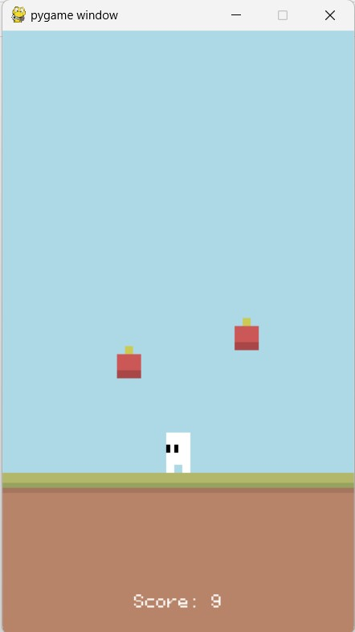

# Pygame Apple Catcher Game

## Description

This is a simple Pygame-based game where you control a character to catch falling apples. The goal is to catch as many apples as possible and increase your score.

## Features

- Control the character using the left and right arrow keys.
- Apples fall from the top, and you must catch them using your character.
- Each apple you catch increases your score.
- The game gets progressively faster as you catch more apples.
